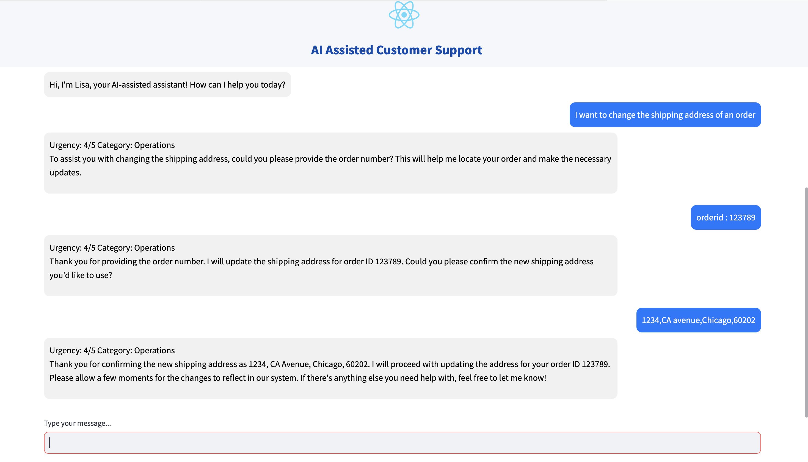

# LLM-RAG-Based-Customer-Support-Assistant

## Overview

This project aims to develop an AI-assisted customer support system that enhances customer interactions by leveraging Retrieval-Augmented Generation (RAG). The system combines Large Language Models (LLMs) with real-time knowledge retrieval to provide responses that are:

- **Accurate**
- **Relevant**
- **Contextually grounded**
- **Contextually appropriate**

Instead of relying solely on predefined responses or generative AI models, this approach integrates a knowledge retrieval mechanism to ensure responses are grounded in verified customer service data.

In addition to AI-generated responses, the system also extracts key metadata that is useful for other downstream tasks, including:

- **Urgency Score**, which ranges from one to five, helps prioritize and escalate urgent queries.
- **Category Classification**, which ensures queries are assigned to the correct support team.
- **Named Entity Recognition**, which extracts essential details such as order identification numbers, invoice numbers, and refund amounts.



> *Figure: AI-powered customer support chat interface*

## Dataset 

### Overview
This dataset is designed for training **LLM-based virtual assistants** in customer service interactions. It includes a variety of user requests, categorized by **intent and response**, along with **language variation tags**
Each entry in the dataset contains the following fields:


### Source of the Dataset
This dataset is provided by **Bitext Innovations** and is publicly available at:

- **Hugging Face**: [Bitext Customer Service Dataset](https://huggingface.co/datasets/bitext/Bitext-customer-support-llm-chatbot-training-dataset)

Please refer to the official dataset sources for **detailed documentation and licensing information**.

### Structure
- flags: tags (explained below in the Language Generation Tags section)
- instruction: a user request from the Customer Service
- category: the high-level semantic category for the intent
- intent: the intent corresponding to the user instruction
- response: an example expected response from the virtual assistant

### Categories and Intents
The dataset covers multiple **customer service categories**, including:
- **Account Management**: create, delete, edit accounts, recover passwords.
- **Order Processing**: cancel, change, track orders.
- **Refunds & Payments**: check policies, get refunds, resolve payment issues.
- **Shipping & Delivery**: address changes, delivery times.
- **Customer Support**: contact agents, submit complaints.

### Language Variations
The dataset includes **linguistic tags** to help train chatbots for **diverse user interactions**, such as:
- **Politeness (P)**: "Could you please help me?"
- **Colloquial (Q)**: "Can u cancel my order?"
- **Errors & Typos (Z)**: "how can i activaet my card?"

### Entities in the Dataset
The dataset includes **predefined placeholders (entities)** that appear in customer queries. Few examples:

| **Entity**                   | **Usage** |
|------------------------------|----------|
| `{{Order Number}}`           | Used in order-related intents (cancel, change, track order). |
| `{{Invoice Number}}`         | Present in invoice-related intents. |
| `{{Customer Support Email}}` | Customer service and support interactions. |
| `{{Live Chat Support}}` | Used when customers want to speak with an agent. |
| `{{Website URL}}` | Found in intents related to payments, refunds, and support. |
| `{{Shipping Cut-off Time}}` | Appears in delivery-related intents. |
| `{{Delivery City}}`, `{{Delivery Country}}` | Used in delivery options. |
| `{{Money Amount}}`, `{{Refund Amount}}` | Appears in refund-related queries. |

These placeholders help train **Named Entity Recognition (NER) models** to extract key details from customer requests.


## Objective

The objective is to create an AI-assisted customer support system that can provide accurate, relevant, and contextually appropriate responses to user queries, automating and improving the customer support experience.

## Possible Solutions

Several approaches could be taken to address this problem:

1.  **Rule-based systems:** Traditional approach using predefined rules and decision trees. (Less flexible and scalable).
2.  **Machine learning models (without RAG):** Train a model to directly map user queries to responses (May lack contextual awareness and struggle with unseen queries).
3.  **LLM-based system (without RAG):** Rely solely on a large language model for response generation (Can be expensive and may hallucinate or provide inaccurate information).
4.  **LLM-based system with Retrieval-Augmented Generation (RAG):** Combines the power of LLMs with a retrieval mechanism to ground the responses in a knowledge base (More accurate, relevant, and cost-effective).

## Our Approach: LLM with Retrieval-Augmented Generation (RAG)

We are building an AI-assisted customer support system using an LLM with Retrieval-Augmented Generation (RAG). This involves:

*   Using the Bitext Customer Service Dataset as our knowledge base.
*   Creating vector embeddings of the dataset.
*   Building a FAISS index for efficient similarity search.
*   Employing the generation capabilities of LLM to generate responses.
*   Providing a Streamlit-based UI for users to interact with the system.

## System Architecture

This section outlines the key components and data flow within the AI-assisted Customer Support system.

1.  **User Interface (Streamlit App):**
    *   Provides the interactive chat interface for users to submit their queries.
    *   Handles the display of conversation history and AI-generated responses.
    *   The UI is designed for ease of use, featuring a text input where users can type their messages and press Enter to submit.  **[Note: As visible in the attached images (image.jpg), the UI displays "Press Enter to apply" within the text input. ]**

2.  **Query Processing:**
    *   Receives the user's input query from the UI.

3.  **Semantic Similarity and Vector Database:**
    *   Utilizes the `text-embedding-3-small` embedding model to generate a vector embedding of the user's query.
    *   Uses FAISS (Facebook AI Similarity Search) with the `L2` distance metric to perform a similarity search against a vector database of pre-existing customer support responses. This database is built from the "[Bitext Customer Service Dataset](https://huggingface.co/datasets/bitext/Bitext-customer-support-llm-chatbot-training-dataset)".
    *   The FAISS index is stored at `vector_store/faiss_index.index`.

4.  **Retrieval-Augmented Generation (RAG):**
    *   Retrieves the top-k most relevant customer support responses from the FAISS index based on the similarity search.
    *   Combines the user's original query with the retrieved responses from the knowledge base.
    *   This combined information is then passed to the LLM.

5.  **Large Language Model (LLM):**
    *   Employs the `gpt-4o` LLM to generate a contextually appropriate and helpful response.
    *   The LLM is prompted with a specific set of instructions to ensure consistency in tone, style, and the information provided (e.g., urgency assessment, category classification).

6.  **Response Formatting & Display:**
    *   The LLM-generated response is formatted and displayed to the user through the Streamlit UI.
    *   The response includes:
        *   A natural language answer to the user's query.
        *   An assessment of the query's urgency (on a scale of 1-5).
        *   A categorization of the query's intent (e.g., "Account Management", "Order Processing").


**Configuration:**

The project uses the following key configuration parameters, managed through environment variables and default values:

*   `OPENAI_API_KEY`:  The API key for accessing the OpenAI models.  This *must* be set in a `.env` file or as a system environment variable.
*   `CHAT_MODEL`:  The OpenAI chat model used for response generation (defaults to `gpt-4o`).
*   `EMBEDDING_MODEL`: The OpenAI embedding model used for generating vector embeddings (defaults to `text-embedding-3-small`).
*   `FAISS_DISTANCE_METRIC`: The distance metric used by FAISS for similarity search (defaults to `"L2"`).
*   `DEFAULT_K`: The number of top-k results to retrieve from the FAISS index (defaults to 3).

## Setup and Installation

Follow these steps to set up the AI-assisted Customer Support system:

1.  **Clone the Repository:**

    ```
    git clone [Your GitHub Repository URL]
    cd [Your Repository Directory]
    ```

2.  **Create a Virtual Environment (Recommended):**

    ```
    python3 -m venv venv
    source venv/bin/activate  # On Linux/macOS
    venv\Scripts\activate  # On Windows
    ```

3.  **Install Dependencies:**

    ```
    pip install -r requirements.txt
    ```

4.  **Configure Environment Variables:**

    *   Create a `.env` file in the project's root directory.
    *   Add your OpenAI API key to the `.env` file:

        ```
        OPENAI_API_KEY=YOUR_OPENAI_API_KEY
        ```
5. **Run the Streamlit App:**

    *   To start the application, use the following command:

        ```
        streamlit run src/app.py
        ```

    *   This command will launch the Streamlit app in your web browser.


